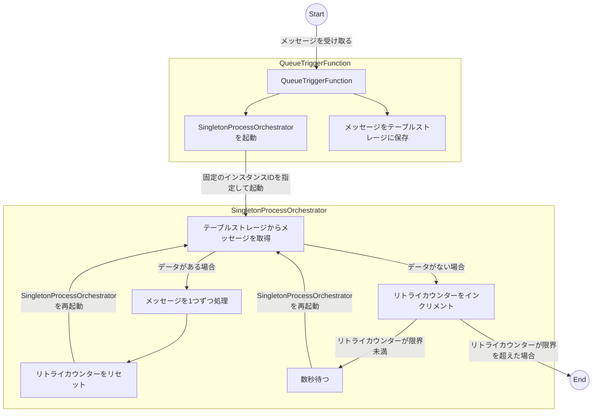

# SingletonFunctionApp

Azure Storage Account の Queue に追加されたメッセージに対して必ず一度に 1 つしか処理が実行されないようにするサンプルプログラムです。

## 使っている物

- .NET 8
- Azure Functions (isolated)

## 実行方法

`SingletonFunctionApp.sln` を Visual Studio で開いて、`SingletonFunctionApp` をデバッグ実行してください。
`MessageCreator` プロジェクトのフォルダーで `dotnet run` を実行することでメッセージキューに指定した数のメッセージが投入されます。
Azure Functions のログを確認して、メッセージの内容が同時に 1 つしか処理されないことを確認してください。

## 仕組み

Azure Functions の in-process では `Singleton` 属性を使うことで 1 度に 1 つしか実行されない関数を作成することができます。
しかし、isolated では、`Singleton` 属性が使えないため、自前で 1 つずつしか実行されないようにする仕組みを作成する必要があります。

ここでは Durable Functions を使用して上記の動作を実現しています。

1. `QueueTrigger` を使ってメッセージを受け取る `QueueTriggerFunction` 関数で以下の処理を行います。
   - `SingletonProcessOrchestrator` という Durable Functions の Orchestrator 関数を起動します。この際に `InstanceId` に `SingletonProcessOrchestrator` という固定値を使用することでオーケストレーター関数の多重起動を防いでいます。
   - `Queue` から受け取ったメッセージをテーブルストレージに保存します。
2. `SingletonProcessOrchestrator` 関数は以下の処理を行います。
   - テーブルストレージに保存されたメッセージを数件取得します。
   - データが取得できた場合はメッセージを順番に 1 つずつ処理をします。
   - データが取得できない場合はリトライカウンターをインクリメントします。
   - リトライカウンターが所定の回数を超えた場合は処理を終了します。
   - 数秒まって `SingletonProcessOrchestrator` 関数を再度起動します。その際にリトライカウンターの値を引き継いでいます。

## 注意点と実際に使う際に追加実装が必要な点

このサンプルは簡単に動作させるためにデータの順序性が保証されないテーブルストレージを使用して Queue からきたメッセージを保持しています。処理の順序が重要な場合は、タイムスタンプなどでソートしてデータの取得が可能な SQL Database や Cosmos DB を使用することをお勧めします。

また、このサンプルは 1 つの種類のメッセージしか処理することが出来ませんがテーブルストレージに保存する際に `処理の種別` と `処理に必要なパラメーター` を保存をして、オーケストレーター関数で処理の呼び分けなどを実装することで複数の種類のメッセージを処理するように実装することも可能だと思います。
